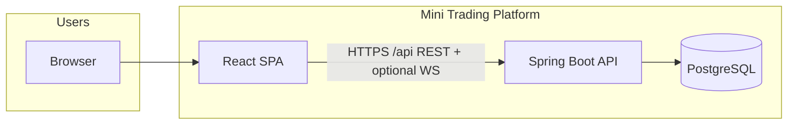
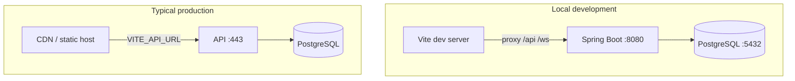
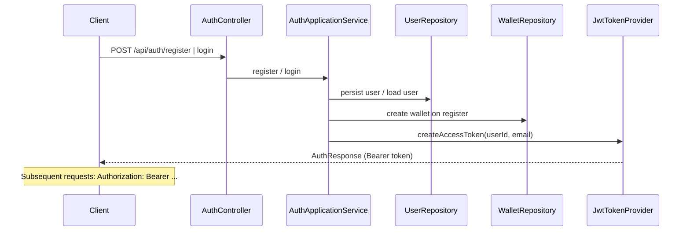
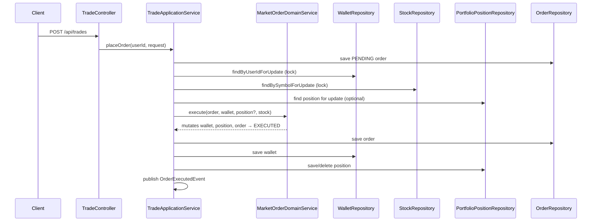
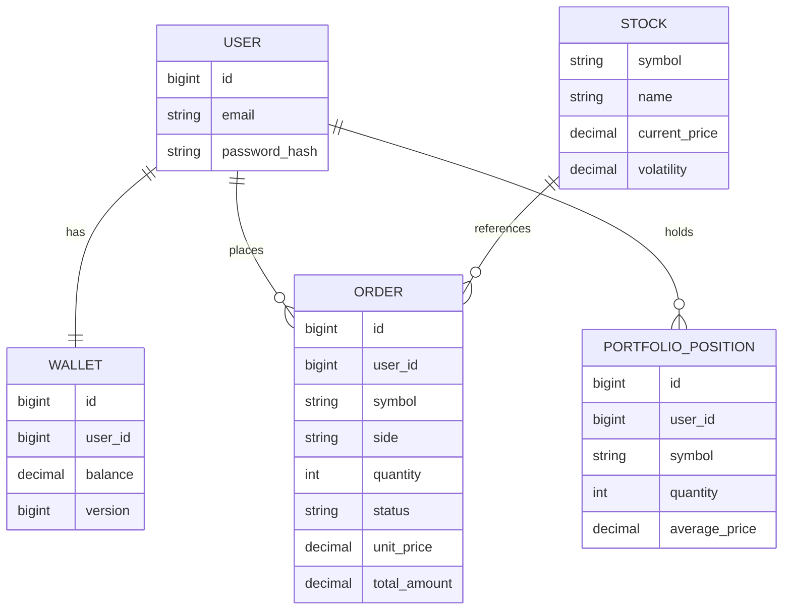

# Mini Trading Platform — Architecture & System Design

This document describes the **logical architecture**, **major components**, **runtime behavior**, and **design decisions** for the mini trading platform (React + Spring Boot + PostgreSQL).

---

## 1. Goals & scope


| Goal                         | How it is addressed                                                                      |
| ---------------------------- | ---------------------------------------------------------------------------------------- |
| Clear separation of concerns | Backend: hexagonal-style layers; frontend: pages, hooks, API layer                       |
| Testable business rules      | Rich domain models (`Wallet`, `PortfolioPosition`, `Order`) + `MarketOrderDomainService` |
| Secure API                   | JWT bearer tokens; Spring Security stateless filter chain                                |
| Data integrity               | JPA transactions; pessimistic locks on wallet/stock/position during trades               |
| Simulated market             | Scheduled price ticks; optional WebSocket broadcast                                      |


**Non-goals:** real exchange connectivity, payment rails, regulatory reporting, horizontal scaling of the matching engine.

---

## 2. System context




- **Browser** runs the SPA (static assets or Vite dev server).
- **API** owns auth, wallet, portfolio, orders, and simulated market data.
- **PostgreSQL** is the system of record.

---

## 3. Container view (deployment)




- **Development:** `frontend/.env.development` sets `VITE_DEV_PROXY_TARGET`; the UI calls same-origin `/api/...` and Vite forwards to Spring Boot.
- **Production:** the built SPA uses `VITE_API_URL` (or same-origin `/api` behind a reverse proxy).

---

## 4. Backend architecture (hexagonal / clean)

### 4.1 Layering & dependency rule

Dependencies point **inward**: infrastructure and presentation depend on **application** and **domain**; **domain** has **no** Spring or JPA imports.


| Layer              | Package                                              | Responsibility                                                                                                                                 |
| ------------------ | ---------------------------------------------------- | ---------------------------------------------------------------------------------------------------------------------------------------------- |
| **Domain**         | `com.saifcores.trading.domain`                       | Entities/aggregates (pure Java), repository **ports**, domain services (`MarketOrderDomainService`)                                            |
| **Application**    | `com.saifcores.trading.application`                  | Use cases, DTOs, MapStruct API mappers, Spring events (`OrderExecutedEvent`)                                                                   |
| **Infrastructure** | `com.saifcores.trading.infrastructure`               | JPA entities, Spring Data repositories, **adapters** implementing ports, MapStruct persistence mappers, `StockDataLoader`, `MarketPriceTicker` |
| **Presentation**   | `com.saifcores.trading.presentation`                 | REST controllers only                                                                                                                          |
| **Cross-cutting**  | `com.saifcores.trading.common`, `config`, `security` | Exceptions, global handler, JWT, Security filter chain, CORS, WebSocket broker config                                                          |


### 4.2 Package map (abbreviated)

```
com.saifcores.trading
├── application/
│   ├── dto/              # Request/response records
│   ├── mapper/           # ApiDtoMapper (DTO ↔ domain-facing)
│   ├── service/          # AuthApplicationService, TradeApplicationService, …
│   └── event/            # OrderExecutedEvent, listener
├── domain/
│   ├── model/            # User, Wallet, Order, PortfolioPosition, Stock
│   ├── repository/       # Interfaces (ports)
│   └── service/          # MarketOrderDomainService (pure execution rules)
├── infrastructure/
│   ├── entity/           # JPA entities
│   ├── repository/       # *JpaRepository
│   ├── adapter/          # *RepositoryAdapter → ports
│   ├── mapper/           # Entity ↔ domain (MapStruct)
│   ├── bootstrap/        # Stock seed
│   └── market/           # Price simulation + scheduled ticker
├── presentation/
│   └── controller/       # REST
├── security/             # JWT, UserDetails, filter
└── config/               # Security, WebSocket, properties
```

### 4.3 Ports & adapters

- **Ports** are interfaces in `domain.repository` (e.g. `WalletRepository`, `OrderRepository`).
- **Adapters** in `infrastructure.adapter` implement those ports using JPA repositories + MapStruct mappers to translate **domain** ↔ **entity**.

This keeps persistence details out of use cases and domain logic.

---

## 5. Core runtime flows

### 5.1 Authentication (JWT)




- **Login** uses Spring Security’s `AuthenticationManager` (DAO provider + BCrypt).
- **JWT** is validated in `JwtAuthenticationFilter`; `UserPrincipal` carries `userId` and `email`.

### 5.2 Place market order (trade)




**Concurrency:** wallet (and stock/position where applicable) use **pessimistic write** locks so two orders for the same user do not interleave inconsistently.

**Failures:** business failures (`InsufficientFundsException`, etc.) mark the order **FAILED** and persist; `@Transactional(noRollbackFor = …)` ensures failed orders remain committed for audit.

### 5.3 Simulated market

- `StockDataLoader` seeds symbols and initial prices.
- `MarketPriceTicker` (`@Profile("!test")`) runs on a fixed interval, applies `MarketPriceSimulator` random walk, persists `StockEntity`, and publishes to STOMP topic `/topic/prices`.
- Public REST: `GET /api/market/stocks`.

---

## 6. Data model (logical)



Keys: `USER.id` is primary key; `USER.email` unique; `WALLET.user_id` unique FK to `USER`; other `user_id` columns FK to `USER`; `ORDER.symbol` FK to `STOCK.symbol`.


---

## 7. Frontend architecture


| Area                                    | Role                                                                                                   |
| --------------------------------------- | ------------------------------------------------------------------------------------------------------ |
| **Pages**                               | Route-level UI (`Dashboard`, `Trading`, `Profile`, …)                                                  |
| **Hooks**                               | `useAssets`, `usePortfolioRows`, `useWallet`, `useOrders` — choose API vs mock via `isApiConfigured()` |
| `**lib/api/client.ts`**                 | `fetch` wrapper, `Authorization: Bearer`, skips auth header for `/api/auth/*`                          |
| `**lib/env.ts**`                        | Resolves API base URL (dev proxy, relative, or absolute)                                               |
| `**api/trading.ts**`, `**api/auth.ts**` | Typed endpoints aligned with Spring DTOs                                                               |


**State:** React local state + hooks; JWT and email in `localStorage`; `auth-changed` event for sidebar refresh.

---

## 8. Cross-cutting concerns


| Concern        | Implementation                                                                                                |
| -------------- | ------------------------------------------------------------------------------------------------------------- |
| **Validation** | Jakarta Bean Validation on DTOs (`@NotBlank`, `@Email`, …)                                                    |
| **Errors**     | `GlobalExceptionHandler` → JSON `ApiError` with `code`, `message`                                             |
| **Logging**    | SLF4J in services and listeners                                                                               |
| **CORS**       | `CorsConfig` + `SecurityFilterChain.cors(Customizer.withDefaults())`                                          |
| **Async**      | `@EnableAsync` for `OrderExecutedApplicationListener` (logging side-effect)                                   |
| **Tests**      | Domain unit tests; Spring Boot tests use H2 where applicable; market ticker disabled with `@Profile("!test")` |


---

## 9. Design trade-offs


| Decision                        | Rationale                                                          |
| ------------------------------- | ------------------------------------------------------------------ |
| Single monolith API             | Simplicity; enough for demo and learning                           |
| Pessimistic DB locks            | Correctness over throughput for concurrent orders per user         |
| Simulated prices in DB          | Simple reads for REST; WebSocket for push                          |
| JWT in `localStorage`           | SPA-friendly; production apps often prefer httpOnly cookies + CSRF |
| No Kafka/Redis in default build | Fewer moving parts; events are in-process Spring events            |


---

## 10. Related documents

- [README.md](../README.md) — runbooks, env vars, quick start

For API path and payload details, see controllers under `presentation/controller` and DTOs under `application/dto`.